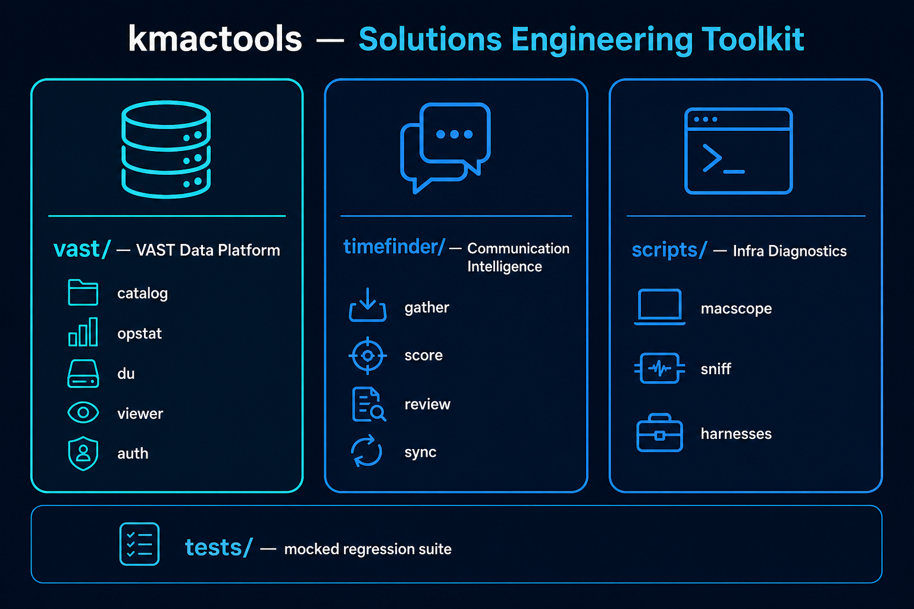
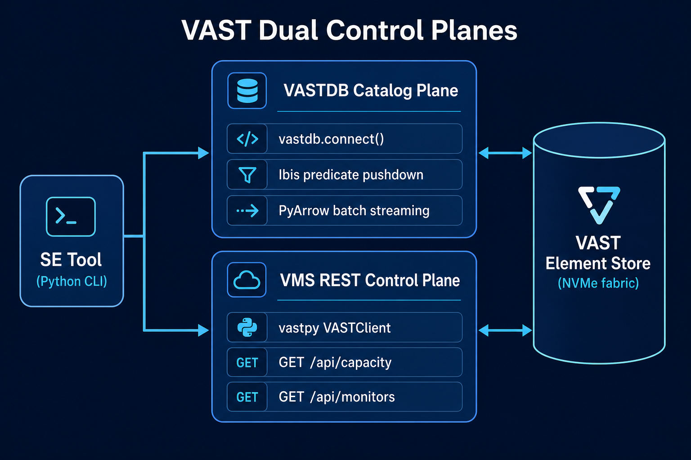

# Architecture

**kmactools** consolidates the tactical utilities used across VAST Solutions Engineering
engagements into one version-controlled repository. It is organized into three
architectural pillars plus a shared test layer.

| Pillar | Path | Focus |
|---|---|---|
| **Storage-fabric engineering** | [`vast/`](../vast/) | Element Store catalog queries, capacity/DRR analysis, VMS auth, multi-protocol performance monitoring, and config auditing |
| **Communication intelligence** | [`timefinder/`](../timefinder/) | Local Slack/Gmail harvesting, thread heuristics, work-journal candidates, Google Calendar sync |
| **Infrastructure diagnostics** | [`scripts/`](../scripts/) | macOS scopes, virtualization debuggers, media transcription, lab harnesses |
| Regression layer | [`tests/`](../tests/) | Mocked unit tests — no live VMS unless explicitly labeled integration |

---

## The VAST dual control planes

Most `vast/` tools talk to a VAST cluster through **two complementary control planes**.
Understanding this split explains why the tools are fast and why they need the
credentials they do.

### 1. VASTDB Catalog Plane

- **Transport:** `vastdb.connect()` (endpoint + access/secret key).
- **Query layer:** Ibis column expressions compile to **server-side predicate pushdown**.
- **Streaming:** PyArrow `RecordBatchReader` yields chunks; the client never materializes
  the whole catalog. This is how `vast-catalog` searches 44M+ files in seconds without
  crawling the filesystem.

### 2. VMS REST Control Plane

- **Transport:** `vastpy.VASTClient` (schema-less: `client.<resource>.get()` →
  `GET /api/<resource>/`).
- **Used for:** capacity/quota reporting (`vast-du`, `vast-catalog`), performance monitors
  (`vast-opstat`), identity/config inspection (`vast-viewer`, `identity`), and token
  issuance (`auth`).

See [Credentials](credentials.md) for how each plane is authenticated.

---

## Module interaction at a glance

- **Shared config:** every VMS tool loads connection details through
  [`vast/common/utils.py`](../vast/common/README.md) (`load_vast_config()`), which
  normalizes the `tenant` field for Global-Admin auth.
- **`vast-opstat`** is a self-contained, stdlib-only monitor with its own REST transport
  and a shared engine core — see the [opstat data-flow diagram](../vast/vast-opstat/README.md).
- **`timefinder`** is fully local and independent of the VAST tree — see the
  [pipeline diagram](../timefinder/README.md).

---

## Design principles

1. **Read-first, non-destructive.** Diagnostic tools default to read-only; data-altering
   operations (quota registration, S3 tags, monitor create/delete) are explicit and
   self-cleaning.
2. **Credentials from files, never hardcoded.** See [Credentials](credentials.md).
3. **Mockable by default.** Core logic is unit-tested without a live cluster
   ([Testing](testing.md)).
4. **Minimal runtime deps where it matters.** `vast-opstat` runs on the Python standard
   library alone so it drops onto any jump host.
