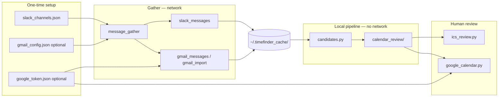

# TimeFinder Architecture

TimeFinder turns Slack (and optionally Gmail) activity into reviewable work-journal calendar entries. Everything runs locally except explicit gather/sync steps that call external APIs.

**Related docs**

| Document | Audience |
|----------|----------|
| [README.md](README.md) | Day-to-day commands and quick start |
| [SETUP_macOS.md](SETUP_macOS.md) | First-time install and credentials |
| [HEURISTICS.md](HEURISTICS.md) | Candidate scoring rules (no LLMs) |

---

## System overview



---

## Pipeline stages

| Stage | CLI flag | Network? | Output |
|-------|----------|----------|--------|
| Configure Slack | `--init-channels`, `--add-slack-channels`, `--discover-slack-channels` | Yes (discover/add) | `slack_channels.json` |
| Configure Gmail | manual `gmail_config.json` | No | `gmail_config.json` |
| Gather | `--gather-candidate-entries` | Yes (Slack/Gmail API or local import) | `slack_*.json`, `gmail_*.json` |
| Generate | `--generate-candidates` | **No** | `calendar_review/calendar_candidates.*` |
| Review | `--review-ics` | No | Updated `.ics` |
| Sync | `--sync-google` | Yes (Calendar API) | Google Calendar events |

**Candidate generation is fully offline.** Scoring reads only local JSON backups; see [HEURISTICS.md](HEURISTICS.md).

---

## Entry point

`timefinder.py` is a thin dispatcher. Each capability owns its own argument parser and `run_*` function:

```
timefinder.py
  ├── channels_init.py       → --init-channels
  ├── channels_resolve.py    → --add-slack-channels
  ├── channels_discover.py   → --discover-slack-channels
  ├── message_gather.py      → --gather-candidate-entries
  ├── candidates.py          → --generate-candidates
  ├── ics_review.py          → --review-ics
  ├── google_auth.py         → --setup-google-auth
  ├── google_calendar.py     → --sync-google
  └── thread_harvest.py      → --harvest-thread
```

Only one action flag may be passed per invocation.

---

## Module reference

| Module | Responsibility |
|--------|----------------|
| `slack_messages.py` | Slack API: history, thread replies, user lookup, backup to JSON |
| `channels_discover.py` | Scan all visible conversations for user posts in a date window; inline config updates |
| `channels_init.py` | Bootstrap config from a fixed channel name list |
| `channels_resolve.py` | Interactive name → channel ID resolver (channels, DMs, group DMs) |
| `message_gather.py` | Orchestrates Slack + optional Gmail gather; `--slack-only`, `--require-gmail` |
| `gmail_messages.py` | Gmail IMAP, OAuth API, or routes to local import |
| `gmail_import.py` | Read `.eml` / `.mbox` (Takeout) without Google credentials |
| `candidates.py` | Load backups, cluster, score, dedupe, write review files |
| `ics_review.py` | Terminal wizard: approve / remove / modify ICS events |
| `google_auth.py` | Shared OAuth flow for Gmail + Calendar |
| `google_calendar.py` | Push approved JSON or ICS events to primary calendar |
| `thread_harvest.py` | Deep harvest of one channel + all thread replies |

---

## Data layout (`~/.timefinder_cache/`)

```
~/.timefinder_cache/
├── slack_channels.json          # token, cookie, channel name → ID
├── slack_users.json             # user ID → display name (auto-updated)
├── gmail_config.json            # optional: import | imap | oauth
├── gmail_import/                # optional: .eml / .mbox drop zone
├── google_client_secret.json    # optional: OAuth desktop client
├── google_token.json            # optional: OAuth token
├── slack_{channel}_{date}.json  # gathered Slack messages
├── gmail_{folder}_{date}.json   # gathered Gmail messages
└── calendar_review/
    ├── calendar_candidates.json
    ├── calendar_candidates.md
    └── calendar_candidates.ics
```

Gather escribe dated backup files; generate reads **message timestamps** inside those files, filtered by `--date` and `--lookback-days` (inclusive window from start-of-day through end-of-reference-day).

---

## Authentication models

### Slack

| Token type | Used for | Config field |
|------------|----------|--------------|
| `xoxp-` service token | Gather, discover (recommended) | `slack_token` |
| `xoxc-` browser token | Some harvest scenarios | `slack_token` + `slack_d_cookie` |

Channel targets live in `slack_channels.json` → `channels` map (`name` → `C…` / `D…` ID).

**Discovery vs. resolve:** `--discover-slack-channels` scans every conversation you can access, finds where *you* posted in the lookback window, and can append untracked IDs to config without re-querying Slack. `--add-slack-channels` resolves names you type interactively.

### Gmail (optional)

| Mode | `auth` value | Credentials |
|------|--------------|-------------|
| Local import | `import` | Files in `gmail_import/` |
| IMAP | `imap` | Email + app password |
| OAuth API | `oauth` | `google_token.json` |

If Gmail is not configured, gather succeeds with `--slack-only` (default behavior skips Gmail with a message). Use `--require-gmail` to fail when Gmail is missing.

### Google Calendar (optional)

Requires OAuth (`--setup-google-auth`). Independent of Gmail import mode — you can import mail locally and still sync approved entries to Calendar if OAuth is allowed.

---

## Date and lookback semantics

Shared by `--discover-slack-channels`, `--gather-candidate-entries`, and `--generate-candidates`:

| Input | Window end | Window start |
|-------|------------|--------------|
| `--date 2026-06-26` | 2026-06-26 23:59:59 | 2026-06-19 00:00:00 (with `--lookback-days 7`) |
| (no `--date`) | now | start of `(today − lookback_days)` |

Implemented in `candidates.parse_reference_date()` and `candidates.resolve_time_window()`.

---

## Testing

Tests live in `timefinder/tests/`. HTTP, IMAP, and Google APIs are mocked — no live network in CI.

```bash
pytest timefinder/tests/ -v
```

---

## Design constraints

- **Privacy:** raw backups stay local; scoring never phones home.
- **Determinism:** same backups + same `--date` → same candidates.
- **Human in the loop:** all calendar entries start as `pending_review`.
- **No LLM in v1:** summarization and classification are keyword/heuristic only.

Planned: Gmail-aware candidate generation (gather already supports Gmail; scoring is Slack-only today).
