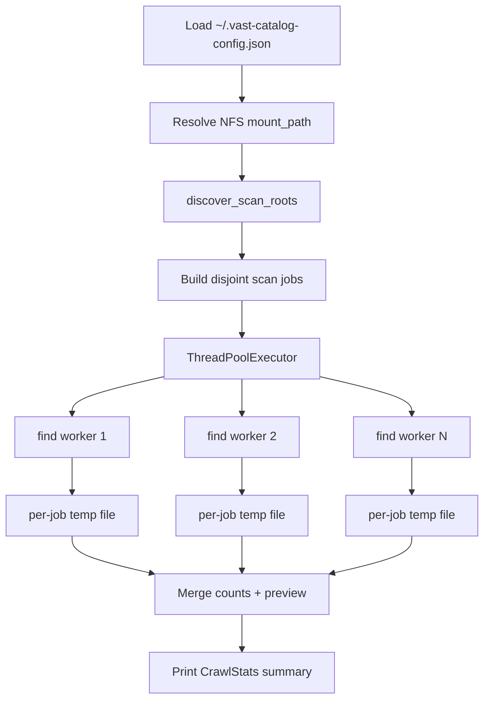

# Algorithm: `find_files_oldschool.py`

This document describes the filesystem crawl algorithm used by
`find_files_oldschool.py` — the **native POSIX baseline** in the VAST Catalog
cyber demo. It exists to benchmark how long a traditional NFS metadata crawl
takes to locate `*.malware` files, compared against a server-side VAST Catalog
pushdown query (`vcatalog_cyberdemo.py --query-catalog-malware-files`).

---

## Design goal

Maximize throughput over a large NFS-mounted dataset (~50M files) while:

1. **Avoiding duplicate work** — each inode path is scanned by exactly one worker.
2. **Saturating parallelism** — keep enough concurrent `find` processes busy to
   hide NFS latency without spawning wasteful overlap.
3. **Delegating the hot path to C** — Python orchestrates; GNU `find` performs
   the recursive directory walk (faster than a pure Python `os.walk` at scale).
4. **Producing auditable metrics** — wall-clock time, per-job timing, match rate,
   and sample output for demo comparisons.

---

## High-level pipeline



---

## Phase 1 — Configuration

| Input | Source |
|---|---|
| NFS mount path | `mount_path` in `~/.vast-catalog-config.json` |
| Thread budget | `--threads` CLI flag (default: 64) |
| Target pattern | `*.malware` (hard-coded glob) |

The mount path is normalized to include a trailing slash so prefix stripping in
reports is consistent.

---

## Phase 2 — Work partitioning (`discover_scan_roots`)

The tree is split into **disjoint scan jobs** before any `find` process starts.
Each job is a tuple `(root_path, maxdepth)`:

| `maxdepth` | Meaning |
|---|---|
| `None` | Full recursive crawl from `root_path` |
| `1` | Shallow crawl — files directly under `root_path` only (no subdirectories) |

### Partition rules

```
INPUT:  mount_path, target_parallelism (== --threads)

1. List immediate subdirectories of mount_path → TLDs (top-level dirs)

2. IF no TLDs exist:
       return [(mount_path, None)]          # single full-tree job

3. IF count(TLDs) >= target_parallelism:
       return [(tld, None) for each TLD]    # one full recursive job per TLD

4. ELSE (few TLDs, need more parallelism — fan-out):
   FOR each TLD:
       list L2 subdirectories
       IF L2 subdirs exist:
           append (TLD, maxdepth=1)         # shallow pass for files AT the TLD root
           append (sub, None) for each L2   # full recursive pass per L2 branch
       ELSE:
           append (TLD, None)               # no L2 dirs → full recursive on TLD
```

### Why disjoint partitioning matters

A naive parallel crawl might assign both a parent directory **and** its children
to different workers. Because `find` is recursive, the parent job would re-walk
subtrees already covered by child jobs, **double-counting** matches and wasting
NFS round-trips.

The fan-out strategy avoids overlap:

- `(TLD, maxdepth=1)` covers files sitting **directly** in the TLD directory.
- `(L2_subdir, maxdepth=None)` covers everything **below** each L2 subdirectory.
- No path appears in two recursive jobs.

### Example

```
/mnt/kmacs-root/vast-catalog/
├── dataset_a/
│   ├── file.malware          ← caught by (dataset_a, maxdepth=1)
│   └── batch_01/
│       └── nested.malware    ← caught by (dataset_a/batch_01, maxdepth=None)
└── dataset_b/
    └── deep/…                ← caught by (dataset_b, maxdepth=None) if no L2 fan-out
```

---

## Phase 3 — Parallel execution (`run_crawl`)

```
workers = min(count(scan_jobs), --threads)

CREATE temp directory
FOR each scan job:
    map job → dedicated output file (hits_0000.txt, hits_0001.txt, …)

START wall-clock timer

SUBMIT each job to ThreadPoolExecutor:
    _scan_root(root, out_file, maxdepth)

WAIT for all futures (as_completed)

STOP wall-clock timer
```

### Concurrency model

- **Orchestrator:** Python `ThreadPoolExecutor` (I/O-bound — threads release the
  GIL while waiting on subprocess/NFS I/O).
- **Worker:** one `find` subprocess per job, writing results to its own temp file.

### Why per-job temp files

An earlier single-file design had all parallel `find` processes append to one
shared output file. That creates:

- **Write contention** on a single inode.
- **Line interleaving risk** under heavy parallelism.

Each worker writes to an isolated file; the merge pass is sequential but cheap
relative to the crawl itself.

---

## Phase 4 — Single-worker find command (`_build_find_cmd`)

Each worker executes a native GNU/BSD `find`:

```bash
find <scan_root> [-O3] -type f -name '*.malware' [-maxdepth N]
```

| Flag | Purpose |
|---|---|
| `-type f` | Regular files only (skip directories) |
| `-name '*.malware'` | Glob match on basename — cheapest filter available to `find` |
| `-maxdepth N` | Optional shallow slice (used for TLD root passes during fan-out) |
| `-O3` | **GNU findutils only** — aggressive optimization level; reduces unnecessary stat calls when the predicate is a simple name match |

If GNU findutils is not detected (`find --version`), `-O3` is omitted and the
command falls back to standard find behavior.

Exit codes `0` and `1` are treated as success (`1` means some paths were
inaccessible — normal on large NFS trees).

---

## Phase 5 — Aggregation (`CrawlStats`)

After all workers finish:

1. **Merge** — sequentially read each temp file, count total matches, collect
   the first 10 paths for preview.
2. **Per-job metrics** — each worker records its own elapsed time and match count
   in a `JobResult`.
3. **Derived heuristics:**

   | Metric | Formula / source |
   |---|---|
   | Wall-clock time | `perf_counter` across entire thread pool |
   | Match discovery rate | `total_matches / wall_seconds` |
   | Avg job duration | mean of per-job elapsed times |
   | Slowest / fastest job | max / min per-job elapsed |
   | Jobs with hits | count of jobs where `matches > 0` |
   | Catalog speedup hint | `wall_seconds / 4.0` vs. ~4 s catalog reference |

4. **Cleanup** — delete temp files and directory.

---

## Complexity and scaling behavior

| Dimension | Behavior |
|---|---|
| **Time** | O(total files + total directories) across all jobs — linear in tree size, divided roughly by parallelism |
| **NFS load** | Proportional to worker count; fan-out increases metadata RPC pressure to saturate links |
| **Memory (Python)** | O(preview_limit + job count) — match paths are streamed from disk, not held in RAM |
| **Disk (temp)** | O(match count) during crawl — one line per hit across N temp files |

At ~50M file scale, wall-clock time is typically **minutes to hours**, scaling
linearly with dataset size and inversely with effective parallelism — the
behavior this demo contrasts against sub-second VAST Catalog queries.

---

## Limitations

1. **Name-only matching** — `-name '*.malware'` matches on basename glob, not a
   catalog-style indexed extension column. Equivalent for this demo's file naming
   convention but not a general metadata query engine.
2. **No incremental / cached index** — every run re-walks the tree from scratch.
3. **Fan-out depth is fixed at L2** — if the mount has a single TLD with a deep
   flat subtree, parallelism may stay below `--threads` unless there are many
   L2 directories.
4. **Platform variance** — `-O3` requires GNU findutils; BSD/macOS find uses a
   different optimization model.

---

## Demo comparison

| Method | Mechanism | Typical scale behavior |
|---|---|---|
| **This script** | Parallel POSIX `find` over NFS | Linear crawl; minutes+ at 50M files |
| **`vcatalog_cyberdemo.py --query-catalog-malware-files`** | VAST Catalog pushdown on indexed `extension` column | Sub-second to few seconds |

Run both after `--simulate-malware` (with ~30–90 s catalog sync lag) to
demonstrate the blast-radius detection gap.

---

## Reference implementation map

| Algorithm step | Function |
|---|---|
| Config load | `load_config`, `resolve_mount_path` |
| Work partitioning | `discover_scan_roots` |
| Find command assembly | `_build_find_cmd`, `_gnu_find_o3_supported` |
| Worker execution | `_scan_root` |
| Parallel orchestration | `run_crawl` |
| Metrics & reporting | `CrawlStats`, `print_report` |
