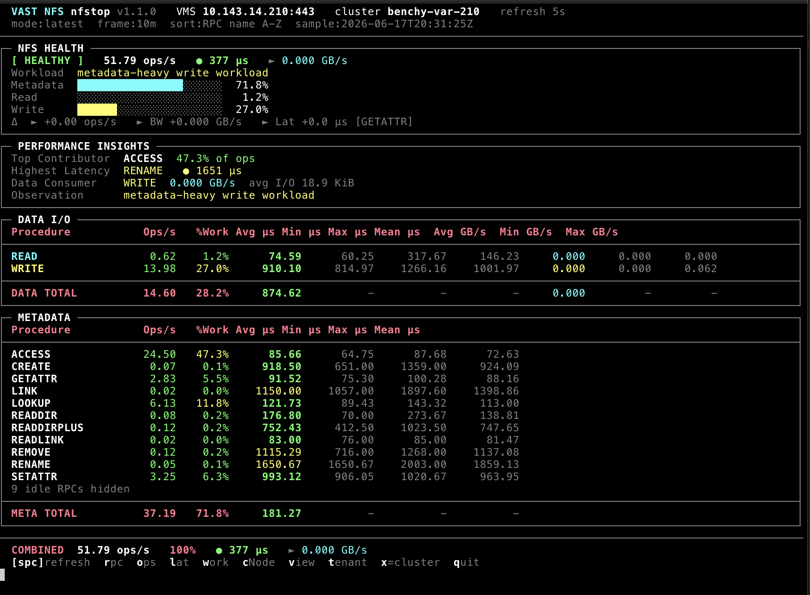

# vast-opstat — NFS v3

Live NFS v3 RPC performance monitor for VAST VMS clusters.

Displays NFS RPC operation statistics with health summaries, workload
classification, latency metrics, throughput, I/O sizing, delta tracking, and
interactive drill-down — in a terminal display that refreshes on an interval.



## Quick Start

```bash
./vast-opstat.py --nfs --version=3.0 --vms <VMS_HOST>
./vast-opstat.py --nfs --version=3.0 --vms <VMS_HOST> --discover-metrics
```

If `--password` is omitted, you will be prompted securely. The `VAST_PASSWORD`
environment variable is also accepted.

### Remote cluster via SSH tunnel

For zero-trust or Teleport environments where VMS is not directly reachable, forward
a local port and aim opstat at it:

```bash
ssh -L 8443:var203.selab.vastdata.com:443 user@jump-host
./vast-opstat.py --nfs --version=3.0 --vms localhost --vms-port 8443 --user admin
```

## Usage

```
vast-opstat.py --nfs --version=3.0 [options]
```

| Option | Default | Description |
|--------|---------|-------------|
| `--nfs` | — | Select NFS protocol (required) |
| `--version=3.0` | — | NFS version (required with `--nfs`) |
| `--vms HOST` | — | VMS hostname or IP (use `localhost` with an SSH tunnel) |
| `--vms-port PORT` | `443` | VMS HTTPS port (`--port` legacy alias) |
| `--user USER` | `admin` | VMS username |
| `--password PASS` | — | VMS password |
| `--sample-average WIN` | — | Rolling average window (e.g. `10m`, `1h`, `4h`) |
| `--refresh N` | `5` | Refresh interval in seconds |
| `--csv FILENAME` | — | Append captured samples to a CSV file |
| `--no-color` | — | Disable ANSI color output (for piping/logging) |
| `--discover-metrics` | — | Print available metrics and objects, then exit |
| `--log-api-calls` | — | Log VMS REST API traffic to `/tmp/vast-opstat-api-*.log` |

## Display Layout

Each refresh cycle renders four panels:

1. **NFS HEALTH** — status badge, total ops/s, combined latency, throughput, workload mix bars, refresh deltas
2. **PERFORMANCE INSIGHTS** — top contributor, highest latency, data consumer, top delta mover
3. **DATA I/O** — READ and WRITE rows with throughput and I/O size
4. **METADATA** — all other RPC procedures, sorted interactively

A combined footer shows cluster totals and keyboard shortcut hints.

## Keyboard Controls

| Key | Action |
|-----|--------|
| `Space` | Force immediate refresh |
| `r` | Sort by RPC name (A–Z) |
| `o` | Sort by operations/sec (high→low) |
| `l` | Sort by average latency (high→low) |
| `w` | Sort by % workload (high→low) |
| `c` | Enter cNode drill-down |
| `v` | Enter view/export drill-down |
| `t` | Enter tenant drill-down |
| `x` | Exit drill-down, return to cluster view |
| `q` | Quit |

### Color Coding

| Color | Meaning |
|-------|---------|
| **Bold cyan** | READ ops, header |
| **Bold yellow** | WRITE ops |
| **Bold green** | Healthy latency (<1 ms), positive ops/BW delta |
| **Yellow** | Moderate latency (1–10 ms), >10% workload |
| **Bold red** | High latency (>10 ms), >50% workload |
| **Dim** | Zero/null values, min/max run stats, separators |
| **Cyan** | Read throughput, data consumer |

### Latency Thresholds

| Status | Threshold |
|--------|-----------|
| HEALTHY | < 1,000 µs |
| MODERATE LATENCY | 1,000–5,000 µs |
| ELEVATED LATENCY | 5,000–10,000 µs |
| DEGRADED | 10,000–50,000 µs |
| CRITICAL | > 50,000 µs |

## Workload Classification

The monitor automatically classifies the observed workload pattern based on
the proportion of read, write, and metadata operations, plus average I/O size:

| Classification | Heuristic |
|----------------|-----------|
| Idle / no load | < 0.5 ops/s total |
| directory traversal | READDIR/READDIRPLUS > 25% of ops |
| namespace churn | CREATE+MKDIR+REMOVE+RMDIR > 30% |
| metadata-heavy | metadata ops ≥ 80% |
| read-heavy | READ > 3× WRITE, I/O ≥ 80% |
| write-heavy | WRITE > 3× READ, I/O ≥ 80% |
| balanced read/write | both I/O types active, I/O ≥ 80% |
| mixed workload | mixed I/O and metadata |

I/O size qualifiers (`small-file` < 8 KiB, `large-block` ≥ 64 KiB) are
prepended to the classification when I/O operations are dominant.

## Drill-Down Mode

Press `c`, `v`, or `t` to break the cluster-aggregate view down by cNode,
view/export, or tenant. The tool:

1. Fetches the list of objects from the VMS API.
2. Creates one RPC monitor + one bandwidth monitor per object (up to 8 objects).
3. Refreshes on the normal interval, showing per-object totals sorted by
   total ops/s.
4. Press `x` to exit drill-down and destroy the extra monitors.

> **Note**: Drill-down requires that the VMS supports per-object NFS monitors
> (i.e. `object_type=cnode/view/tenant` in the monitors API). If the VMS does
> not support this, the tool reports the error and remains in cluster view.

## CSV Export

With `--csv nfs.csv`, each refresh appends one row per RPC procedure to the
specified file, including timestamps, cluster identity, all metric values, and
run-min/max/mean statistics. If the file is new or empty, the header row is
written automatically.

## Metric Discovery

```bash
./vast-opstat.py --nfs --version=3.0 --vms <VMS_HOST> --discover-metrics
```

This mode:

- Connects to the VMS and identifies the cluster.
- Queries `/api/cnodes/`, `/api/views/`, `/api/tenants/`, `/api/vips/` and
  reports object counts and sample names.
- Creates a temporary NFS RPC monitor, queries its `prop_list`, reports all
  available metric FQNs, then deletes the monitor.
- Reports drill-down availability for each object type.

Use this to verify connectivity and to identify which metrics the VMS version
supports before committing to a monitoring session.

## Monitored RPC Procedures

All 22 standard NFS v3 RPC operations are tracked:

NULL, GETATTR, SETATTR, LOOKUP, ACCESS, READLINK, READ, WRITE, CREATE, MKDIR,
SYMLINK, MKNOD, REMOVE, RMDIR, RENAME, LINK, READDIR, READDIRPLUS, FSSTAT,
FSINFO, PATHCONF, COMMIT

## API Interaction

The NFS v3 module uses two API monitors per session:

| Monitor | Metrics | Endpoint |
|---------|---------|----------|
| RPC | `NfsMetrics,nfs_{op}_latency__rate` + `__avg` for all 22 procedures | `POST /api/monitors/` then `GET /api/monitors/{id}/query/` |
| Bandwidth | `ProtoMetrics,proto_name=NFSCommon,rd_bw` + `wr_bw` | Same |

Monitors are created at startup with `object_type=cluster` and deleted on exit
(including on SIGINT/SIGTERM). Drill-down modes create additional temporary
monitors per object, also deleted on exit.

### API Assumptions

- VMS responds at `https://{host}[:{port}]/api/` with HTTP Basic Auth.
- `POST /api/monitors/` accepts `object_type`, `object_ids`, `time_frame`,
  `aggregation`, `query_aggregation`, `prop_list`, and optionally `granularity`.
- `GET /api/monitors/{id}/query/` returns `{"prop_list": [...], "data": [[timestamp, ...], ...]}`.
- Metric FQNs follow the pattern `NfsMetrics,nfs_{op}_latency__{rate|avg}`.
- NULL operation uses `NfsMetrics,nfs_null` (no latency suffix).
- Bandwidth uses `ProtoMetrics,proto_name=NFSCommon,{rd_bw|wr_bw}`.
- `/api/clusters/` returns a list with at least one entry containing `id` and `name`.
- Drill-down object endpoints: `/api/cnodes/`, `/api/views/`, `/api/tenants/`.
- Drill-down `object_type` values: `cnode`, `view`, `tenant`.

If any of these assumptions differ in a specific VMS version, `--discover-metrics`
will surface the discrepancy before a monitoring session is started.

## Examples

```bash
# Live monitor
./vast-opstat.py --nfs --version=3.0 --vms var203.selab.vastdata.com --user admin

# Rolling one-hour average
./vast-opstat.py --nfs --version=3.0 --vms var203.selab.vastdata.com --sample-average 1h

# CSV export
./vast-opstat.py --nfs --version=3.0 --vms var203.selab.vastdata.com --csv nfs_stats.csv

# Metric discovery
./vast-opstat.py --nfs --version=3.0 --vms var203.selab.vastdata.com --discover-metrics
```

## Architecture

```
vast-opstat.py  (--nfs --version=3.0)
    │
    ▼
nfs_v3.run()
    ├── get_current_cluster()        → CLUSTER_ID, CLUSTER_NAME
    ├── create_monitor("rpc", ...)   → RPC_MONITOR_ID
    ├── create_monitor("bw",  ...)   → BW_MONITOR_ID
    │
    └── loop every REFRESH_SECONDS
            ├── fetch_monitor_query()
            ├── fetch_drill_query()  (if drill active)
            └── render_screen()
```

Implementation: [nfs_v3.py](nfs_v3.py)
