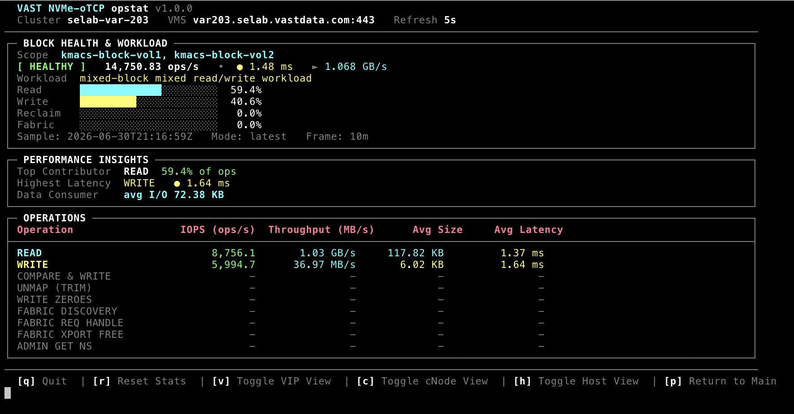

# vast-opstat — NVMe-oTCP Block Monitoring

Enterprise-grade, live NVMe-over-TCP block performance monitor for VAST VMS clusters.
Queries VMS performance counters and renders a full-screen terminal dashboard with
cluster-wide or multi-volume scoping, host initiator drill-down, path health views,
and CSV export.



**Implementation:** [nvme_tcp.py](nvme_tcp.py)

---

## Quick Start

```bash
# Cluster-wide block telemetry
./vast-opstat.py --block --nvme-over-tcp --vms var203.selab.vastdata.com --user admin

# Scope to one or more volumes
./vast-opstat.py --block --nvme-over-tcp --vms var203.selab.vastdata.com \
  --volumes kmacs-block-vol1,kmacs-block-vol2 --user admin

# Metric discovery (no live dashboard)
./vast-opstat.py --block --nvme-over-tcp --vms var203.selab.vastdata.com --discover-metrics
```

If `--password` is omitted, you are prompted securely. The `VAST_PASSWORD` environment
variable is also accepted.

For first-time setup (Python install, virtual environment, dependencies), see
[SETUP.md](SETUP.md).

---

## CLI Syntax

```
vast-opstat.py --block --nvme-over-tcp --vms <HOST> [options]
```

### Required flags

| Flag | Description |
|------|-------------|
| `--block` | Select block storage protocol |
| `--nvme-over-tcp` | NVMe-oTCP transport (required with `--block`) |
| `--vms HOST` | VMS hostname or IP (use `localhost` with an SSH tunnel) |

### Block-specific scoping

| Flag | Description |
|------|-------------|
| `--volume NAME` | Limit stats to a single volume (alias for `--volumes`) |
| `--volumes vol1,vol2` | Comma-separated list of volume names to scope monitors |

When volume scoping is active, monitors use `object_type=volume` and `VolumeMetrics`
for **read/write** only. Reclaim, fabric, and admin operations continue to use
cluster-scoped `BlockMetrics` supplement monitors so those rows stay populated.

### Shared connection & output options

| Option | Default | Description |
|--------|---------|-------------|
| `--vms-port PORT` | `443` | VMS HTTPS port (`--port` legacy alias) |
| `--user USER` | `admin` | VMS username |
| `--password PASS` | — | VMS password |
| `--sample-average WIN` | — | Rolling average window (`10m`, `1h`, `4h`) |
| `--refresh N` | `5` | Dashboard refresh interval (seconds) |
| `--csv FILENAME` | — | Append captured samples to CSV |
| `--no-color` | — | Disable ANSI color output |
| `--discover-metrics` | — | Print available metrics/objects, then exit |
| `-V` / `--tool-version` | — | Print vast-opstat version |

### Examples

```bash
# Live monitor with 10-minute rolling average
./vast-opstat.py --block --nvme-over-tcp --vms var203.selab.vastdata.com \
  --sample-average 10m --refresh 5

# Single-volume scope + CSV export
./vast-opstat.py --block --nvme-over-tcp --vms var203.selab.vastdata.com \
  --volume kmacs-block-vol1 --csv nvme_block_stats.csv

# Multi-volume scope
./vast-opstat.py --block --nvme-over-tcp --vms var203.selab.vastdata.com \
  --volumes vol-a,vol-b,vol-c

# Remote cluster via SSH tunnel (Teleport / zero-trust)
ssh -L 8443:var203.selab.vastdata.com:443 user@jump-host
./vast-opstat.py --block --nvme-over-tcp --vms localhost --vms-port 8443 --user admin
```

---

## TUI Layout

Each refresh cycle redraws a fixed-width terminal dashboard (UTF-8 box drawing when
supported). The main view has three core sections:

### 1. BLOCK HEALTH & WORKLOAD

Top summary panel showing aggregate block health and workload composition.

| Element | Description |
|---------|-------------|
| **Scope** | `All Volumes` (cluster-wide) or the resolved volume name(s) when `--volume` / `--volumes` is set |
| **Status badge** | Dynamic health label (`HEALTHY`, `IDLE`, `DEGRADED`, etc.) with color coding |
| **Aggregate metrics** | Total data-path IOPS, weighted average latency, total throughput (GB/s) |
| **Workload classification** | Text label (e.g. *mixed-block read-heavy workload*) derived from read/write/reclaim/fabric mix |
| **Proportional bars** | Colored bars for **Read** (cyan), **Write** (yellow), **Reclaim** (magenta), **Fabric** (blue) |
| **Delta row** | Change since previous sample: IOPS, bandwidth, and worst-case latency shift |
| **Sample footer** | Timestamp, mode (`latest` or rolling `avg`), and API time frame |

### 2. PERFORMANCE INSIGHTS

Compact analytics pane derived from the current operation rows:

| Insight | Description |
|---------|-------------|
| **Top Contributor** | Operation with the highest share of total ops (%) |
| **Highest Latency** | Operation with the highest average latency (µs / ms) |
| **Data Consumer** | Weighted average I/O size across active data-path operations |

### 3. OPERATIONS Table

Detailed per-operation breakdown:

| Column | Description |
|--------|-------------|
| Operation | User-facing label (READ, WRITE, UNMAP, fabric/admin ops, etc.) |
| IOPS (ops/s) | Real-time operations per second |
| Throughput (MB/s) | Data-path bandwidth |
| Avg Size | Average I/O size (B / KB / MB) |
| Avg Latency | Average latency (µs or ms) |

Zero-activity rows display `-` in all numeric columns (not misleading zeros).

---

## Metric Calculations

VMS exposes a mix of **cumulative lifetime counters**, **instantaneous rates**, and
**pre-averaged gauges**. vast-opstat normalizes these into true real-time telemetry.

### Counter delta tracking (cluster & drill-down scope)

For cumulative `BlockMetrics,*_req` counters (READ, WRITE, UNMAP, etc.):

```
IOPS = (counter_now − counter_prev) / Δt
```

- `Δt` is elapsed wall time between poll cycles (`time.monotonic()`).
- State is tracked per scope key (`cluster`, `volume`, `vip`, `cnode`, `blockhost`).
- The first poll after startup shows a **warming up** message until a second sample
  establishes a valid delta.
- Counter resets (negative delta) are handled by treating the current value as the
  new baseline.

This avoids the common pitfall of displaying raw lifetime counter values as if they
were per-second rates.

### Instantaneous rate metrics

Fabric/admin operations use `BlockMetrics,*_latency__rate` counters that VMS already
reports as ops/sec. These are consumed directly (no delta math).

### Volume-scoped metrics

At volume scope, VMS exposes read/write IOPS and latency on the volume object. opstat
creates **two parallel monitor sets** and merges the results:

| Scope | Object | Operations |
|-------|--------|------------|
| Volume | `object_type=volume` | READ, WRITE (+ `VolumeMetrics,*_size__avg` for throughput) |
| Cluster supplement | `object_type=cluster` | COMPARE & WRITE, UNMAP, WRITE ZEROES, fabric, admin |

Reclaim and fabric rows therefore reflect **cluster-wide** activity even when read/write
are scoped to a named volume.

| Field | VolumeMetrics FQN |
|-------|-------------------|
| Read IOPS | `VolumeMetrics,read_latency__rate` |
| Read latency | `VolumeMetrics,read_latency__avg` |
| Write IOPS | `VolumeMetrics,write_latency__rate` |
| Write latency | `VolumeMetrics,write_latency__avg` |
| Avg I/O size | `VolumeMetrics,read_size__avg` / `write_size__avg` |

Volume IOPS is instantaneous (no delta warmup). Throughput is derived:

```
MB/s = IOPS × avg_io_size_bytes / 1_000_000
```

### Cluster throughput & I/O size (ProtoMetrics)

At cluster scope, bandwidth comes from a separate **ProtoMetrics BlockCommon** monitor
(VMS does not allow mixing metric categories):

| Field | Metric FQN |
|-------|------------|
| Read throughput | `ProtoMetrics,proto_name=BlockCommon,rd_bw` (bytes/sec → MB/s) |
| Write throughput | `ProtoMetrics,proto_name=BlockCommon,wr_bw` |
| Read I/O size | `ProtoMetrics,proto_name=BlockCommon,read_size__avg` |
| Write I/O size | `ProtoMetrics,proto_name=BlockCommon,write_size__avg` |

Average block size for data-path ops can also be derived as `throughput / IOPS`.

### Rolling sample average mode

With `--sample-average`, opstat queries time-series data from VMS and computes deltas
across the two newest API timestamps in each series, or averages rate samples over
the configured window.

### Weighted latency

Aggregate and drill-down latency uses IOPS-weighted averages across read/write pairs,
skipping operations with missing or zero weights.

---

## Interactive Views & Keybinds

| Key | Action |
|-----|--------|
| `h` | **Host / Initiator drill-down** — ranked list of block hosts from `/blockhosts/` (`object_type=blockhost`). Shows host name, NQN subtitle, IOPS, throughput, and weighted latency. |
| `v` | **VIP path drill-down** — per-VIP performance from `/vips/` (`object_type=vip`). Useful for multipath imbalance across front-end VIPs. |
| `c` | **cNode path drill-down** — per-cNode performance from `/cnodes/` (`object_type=cnode`). Surfaces backend node skew. |
| `p` | **Return to main** operations table (exit drill-down mode) |
| `r` | **Reset stats** — clears session counters, delta state, and delta baselines |
| `q` | **Quit** — tears down VMS monitors and restores terminal settings |

Drill-down views always query **cluster-scoped BlockMetrics + ProtoMetrics** on the
target object, even when the main dashboard is volume-scoped. Up to 8 objects are
monitored per drill mode.

Press any drill key again to toggle back to the main view.

---

## Monitored Operations

| UI Label | Cluster BlockMetrics | When `--volumes` is set | Category |
|----------|---------------------|-------------------------|----------|
| READ | `read_req` + `read_latency__avg` | `VolumeMetrics,read_latency__rate/avg` | Data I/O |
| WRITE | `write_req` + `write_latency__avg` | `VolumeMetrics,write_latency__rate/avg` | Data I/O |
| COMPARE & WRITE | `compare_and_write_req` + avg | cluster supplement (BlockMetrics) | Data I/O |
| UNMAP (TRIM) | `unmap_req` + avg | cluster supplement (BlockMetrics) | Reclamation |
| WRITE ZEROES | `write_zeros_req` + avg | cluster supplement (BlockMetrics) | Reclamation |
| FABRIC DISCOVERY | `discovery_req` + avg | cluster supplement (BlockMetrics) | Fabric |
| FABRIC REQ HANDLE | `handle_request_latency__rate/avg` | cluster supplement (BlockMetrics) | Fabric |
| FABRIC XPORT FREE | `transport_free_latency__rate/avg` | cluster supplement (BlockMetrics) | Fabric |
| ADMIN GET NS | `get_ns_list_latency__rate/avg` | cluster supplement (BlockMetrics) | Admin |

VMS constraint: unrelated BlockMetrics operations cannot share one monitor. opstat
creates one monitor per compatible metric group and merges query results client-side.

---

## Telemetry Not Yet Exposed

The following NVMe-oTCP telemetry points are **not** available as VMS performance
counters on tested builds. They appear in `--discover-metrics` notes:

- Explicit **FLUSH** command counters
- **CONNECT / DISCONNECT** queue-pair session counters
- **KEEP_ALIVE** heartbeat counters
- **Queue depth** / in-flight command gauges
- **PDU CRC error** and retry counters

When VMS exposes these metrics, they can be added to `nvme_tcp.py` without CLI changes.

---

## CSV Export

With `--csv nvme.csv`, each refresh appends one row per operation including category,
IOPS, latency, throughput, and I/O size. Useful for long-running capture sessions.

---

## Metric Discovery

```bash
./vast-opstat.py --block --nvme-over-tcp --vms <VMS_HOST> --discover-metrics
```

Queries cluster identity, object counts (`/cnodes/`, `/vips/`, `/volumes/`, `/blockhosts/`),
lists configured BlockMetrics/VolumeMetrics operations, ProtoMetrics bandwidth fields,
path drill-down availability, volume scoping notes, and telemetry gaps.

---

## Architecture

```
vast-opstat.py  (--block --nvme-over-tcp)
    │
    ▼
nvme_tcp.run()
    ├── configure_volume_scope()     # optional --volume / --volumes
    ├── create_cluster_monitors()    # volume read/write + cluster supplement + ProtoMetrics
    └── loop every REFRESH_SECONDS
            ├── fetch_monitor_query()
            │       └── merge volume + cluster supplement rows when scoped
            ├── apply_op_rates()     # counter deltas → IOPS
            ├── fetch_drill_query()  # if vip / cnode / host drill active
            └── render_screen()
```

---

## API Assumptions

- VMS responds at `https://{host}[:{port}]/api/` with HTTP Basic Auth or token auth.
- `BlockMetrics`, `VolumeMetrics`, and `ProtoMetrics` **cannot be mixed** in one monitor.
- Within `BlockMetrics`, unrelated operations **cannot share one monitor**.
- `GET /api/metrics/` catalogs available metric FQNs.
- Path drill-down uses `object_type=vip`, `cnode`, or `blockhost`.
- Bandwidth values (`rd_bw`, `wr_bw`) are raw bytes/sec; opstat displays MB/s or GB/s.
- Volume names in `--volumes` are resolved via `GET /api/volumes/`.
