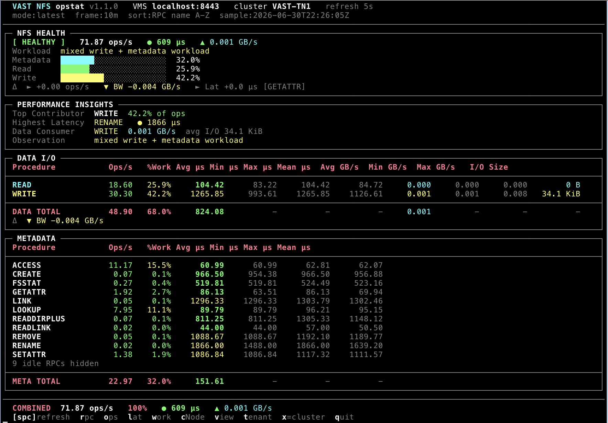

# vast-opstat

Multi-protocol VAST performance statistics tool. Query VMS performance counters and
display live protocol operation rates, latency, throughput, and workload classification
from the terminal.

---

## Getting Started

**New here?** Start with the step-by-step environment guide:

**[SETUP.md — Install Python, create a virtual environment, and run vast-opstat](SETUP.md)**

Runtime dependencies: [requirements.txt](requirements.txt) (stdlib only for execution;
`pytest` is optional for development).



---

## Protocol Reference

| Protocol | CLI flags | Status | Documentation |
|----------|-----------|--------|---------------|
| **NFS v3** | `--nfs --version=3.0` | **Fully Implemented** | **[NFSv3_README.md](NFSv3_README.md)** |
| **NFS v4.1** | `--nfs --version=4.1` | **Fully Implemented** | **[NFSv41_README.md](NFSv41_README.md)** |
| **NVMe-oTCP (block)** | `--block --nvme-over-tcp` | **Fully Implemented** | **[NVMe_TCP_README.md](NVMe_TCP_README.md)** |
| **SMB** | `--smb` | **Fully Implemented** | **[SMB_README.md](SMB_README.md)** |
| NFS v4.2 | `--nfs --version=4.2` | Planned | — |

### Flag rules

- `--block` requires `--nvme-over-tcp`.
- `--version` is **required** with `--nfs` (e.g. `--version=3.0` or `--version=4.1`).
- `--version` is **not** used with `--block` or `--smb`.
- Use `-V` / `--tool-version` to print the vast-opstat release version (currently **0.1.2**).

---

## Quick Start

```bash
cd vast/vast-opstat

# NFS v3 — cluster-wide
./vast-opstat.py --nfs --version=3.0 --vms <VMS_HOST> --user <USER>

# NFS v4.1 — cluster-wide
./vast-opstat.py --nfs --version=4.1 --vms <VMS_HOST> --user <USER>

# NVMe-oTCP block — cluster-wide (all volumes)
./vast-opstat.py --block --nvme-over-tcp --vms <VMS_HOST> --user <USER>

# NVMe-oTCP block — scoped to one or more volumes
./vast-opstat.py --block --nvme-over-tcp --vms <VMS_HOST> \
  --volumes vol1,vol2 --user <USER>

# SMB — cluster-wide (SMBCommon aggregates)
./vast-opstat.py --smb --vms <VMS_HOST> --user <USER>

# Remote cluster via SSH tunnel (Teleport / zero-trust)
./vast-opstat.py --nfs --version=3.0 --vms localhost --vms-port 8443 --user <USER>
```

---

## Global Connection & Ingestion Flags

These flags apply to **every implemented protocol** (NFS v3, NFS v4.1, NVMe-oTCP, SMB):

| Option | Default | Description |
|--------|---------|-------------|
| `--vms HOST` | — | VMS hostname or IP (**required**). Use `localhost` with an SSH tunnel. |
| `--vms-port PORT` | `443` | VMS HTTPS port (`--port` accepted as legacy alias). |
| `--user USER` | `admin` | VMS username |
| `--password PASS` | — | VMS password (prompted securely if omitted; `VAST_PASSWORD` env var accepted) |
| `--sample-average WIN` | — | Rolling average window (`10m`, `1h`, `4h`, …) |
| `--refresh N` | `5` | Dashboard refresh interval in seconds |
| `--csv FILENAME` | — | Append captured samples to CSV |
| `--no-color` | — | Disable ANSI color output |
| `--discover-metrics` | — | Enumerate metrics and objects, then exit |
| `--log-api-calls` | — | Log VMS REST traffic to `/tmp/vast-opstat-api-*.log` |
| `-V` / `--tool-version` | — | Print tool version and exit |

### Cluster-wide vs volume-scoped monitoring (NVMe-oTCP only)

| Mode | Flags | Monitor scope | Behavior |
|------|-------|---------------|----------|
| **Cluster-wide** | `--block --nvme-over-tcp` (no volume flags) | `object_type=cluster` | Aggregates all block volumes; reclaim, fabric, and admin ops included |
| **Multi-volume** | `--volumes vol1,vol2` or `--volume vol1` | `object_type=volume` for READ/WRITE | Data-path IOPS/latency scoped to named volumes; reclaim/fabric/admin remain cluster supplement monitors |

Volume names are resolved at startup via `GET /api/volumes/`. Invalid names produce a
clear error before monitors are created.

NFS protocols always operate at **cluster scope**; there is no volume filter flag for NFS.

### Remote clusters via SSH tunnel

```bash
# Terminal 1 — forward local 8443 to remote VMS HTTPS (443)
ssh -L 8443:var203.selab.vastdata.com:443 user@jump-host

# Terminal 2 — any protocol through the tunnel
./vast-opstat.py --block --nvme-over-tcp --vms localhost --vms-port 8443 --user admin
```

### API call logging

Pass `--log-api-calls` to record every VMS HTTPS request and response under `/tmp`.
The log path is printed on startup. Authorization headers and passwords are never
written to the log.

---

## Features by Protocol

### NFS v3

- Four-panel TUI: health, insights, data I/O, metadata RPC table
- VMS rate metrics with tenant cumulative delta engine for scoped drill-down
- Interactive drill-down: cNode (`c`), view path (`v`), tenant (`t`); exit with `x`
- Batch monitor ranking for view/tenant (top 8 by ops/s)

See **[NFSv3_README.md](NFSv3_README.md)**.

### NFS v4.1

- Three-panel TUI: Data Operations, Stateful Overhead (VMS proxies), Session Workload
- Native NFS4Common instantaneous rates (`__rate`, `rd_iops`) — no counter-delta engine
- Hybrid NfsMetrics fallback when NFS4Common counters read zero
- cNode / view / tenant drill-down (`c` / `v` / `t`)

See **[NFSv41_README.md](NFSv41_README.md)**.

### NVMe-oTCP (block)

- Cluster-wide or multi-volume scoping (`--volume` / `--volumes`)
- Dual-monitor loop: `BlockMetrics`/`VolumeMetrics` + `ProtoMetrics` (BlockCommon)
- Counter-delta IOPS engine with elapsed-time state tracking
- Drill-down: cNode (`c`), VIP (`v`), host initiator (`h`); return with `p`

See **[NVMe_TCP_README.md](NVMe_TCP_README.md)**.

### SMB

- Five-panel TUI: health, insights, data path, metadata aggregates, session placeholder
- `ProtoMetrics,proto_name=SMBCommon` instantaneous rates (no counter-delta on cluster)
- View/tenant drill uses `ViewMetrics` / `TenantMetrics`; cNode uses SMBCommon
- Batch ranking across all views (top 8 by ops/s)
- `--client` / `--clients` flags parse; scoping deferred (Phase 4b)

See **[SMB_README.md](SMB_README.md)**.

---

## Requirements

- Python 3.8+
- No third-party runtime packages (see [requirements.txt](requirements.txt))
- VAST VMS accessible over HTTPS (default port 443)

---

## Credits

NFS v3 monitoring logic is based on the original work of **Jeff Mohler (J-Mo)** in
`vast-nfstop.py`.

---

## Tests

From the repository root:

```bash
python3 -m venv .venv
source .venv/bin/activate          # Windows: .venv\Scripts\activate
pip install pytest pytest-mock
pytest tests/test_vast_opstat.py -v
```
