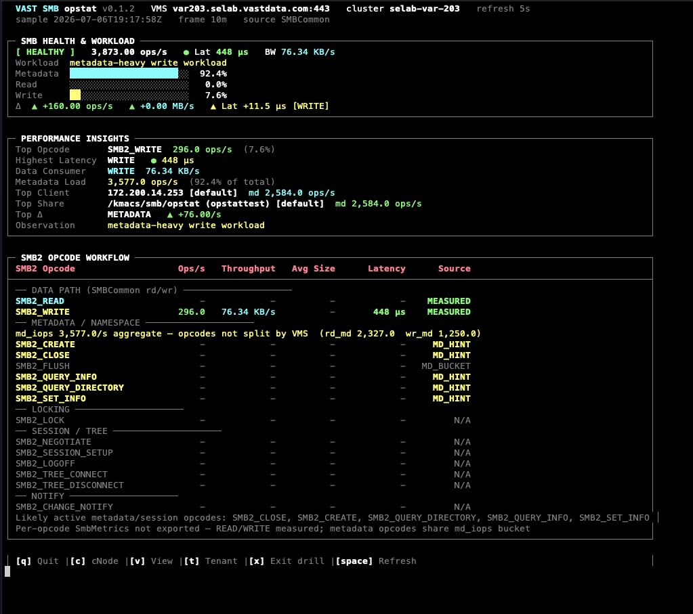

# vast-opstat — SMB

Live SMB performance telemetry from VAST VMS. Maps **ProtoMetrics SMBCommon**
instantaneous rates to a five-panel TUI tuned for metadata-heavy Windows/macOS
workloads. Per-command `SmbMetrics` is not exported on current VMS builds — aggregate
proxy rows are labeled explicitly.



> Screenshot pending: capture during live `--smb` session with
> `scripts/Invoke-SmbOpstatLoad.ps1` (see [images/README.md](images/README.md)).

**Implementation:** [smb.py](smb.py) · **Setup:** [SETUP.md](SETUP.md) ·
**Discovery:** [SMB_PHASE0_RESULTS.md](SMB_PHASE0_RESULTS.md)

---

## Quick Start

```bash
cd vast/vast-opstat

# Live dashboard
./vast-opstat.py --smb --vms <VMS_HOST> --user admin

# Metric discovery (read-only)
./vast-opstat.py --smb --vms <VMS_HOST> --discover-metrics
```

Shared CLI flags (`--vms-port`, `--refresh`, `--sample-average`, `--csv`, `--no-color`,
`--log-api-calls`, `-V`) are documented in [README.md](README.md).

### Generate SMB load (Windows client)

Use the continuous load script in the repo:

```powershell
.\scripts\Invoke-SmbOpstatLoad.ps1 -NasShare '\\172.200.203.6\opstattest'
```

---

## Telemetry Source — SMBCommon

Primary cluster monitor props (Phase 0 validated on var203):

| Field | Role |
|-------|------|
| `rd_iops` / `wr_iops` | Data-path op rates |
| `rd_bw` / `wr_bw` | Throughput (bytes/s → MB/s in TUI) |
| `md_iops`, `rd_md_iops`, `wr_md_iops` | Metadata workload |
| `read_latency__avg` / `write_latency__avg` | Data-path latency |
| `read_size__avg` / `write_size__avg` | Avg I/O size proxies |

**Not exported:** `SmbMetrics,smb_{cmd}_latency__*` (HTTP 400 `property_error`).
Session/locking panel shows a placeholder until a future VMS build exports those counters.

### Workload mix bars

Health panel mix uses **component sum** (`rd + wr + md`) as the denominator so
metadata percentage never exceeds 100%. The aggregate `SMBCommon,iops` field is often
data-path only and must not be used alone for mix math.

---

## Dashboard Panels

1. **SMB HEALTH & WORKLOAD** — status badge, ops/lat/BW, mix bars (metadata / read / write)
2. **PERFORMANCE INSIGHTS** — top contributor, highest latency, data consumer, metadata load
3. **DATA PATH** — READ / WRITE rows (throughput, size, latency)
4. **METADATA & NAMESPACE** — SMBCommon md aggregates (proxy label in footer)
5. **SESSION & LOCKING** — placeholder (per-command counters unexported)

---

## Drill-Down

| Key | Scope | Metrics |
|-----|-------|---------|
| `c` | cNode | `ProtoMetrics,proto_name=SMBCommon,*` |
| `v` | View / **share** | `ViewMetrics,*` (not VIP — unlike NVMe block) |
| `t` | Tenant | `TenantMetrics,*` with cumulative delta engine |
| `x` | Exit drill | Return to cluster dashboard |
| `Space` | Refresh | Immediate poll |
| `q` | Quit | |

View/tenant ranking scans **all** views/tenants in batches of 32, ranks globally by
ops/s, and displays the top 8 — required when the cluster has 100+ views.

View monitors use `no_aggregation=True` (seconds resolution).

---

## Client IP Scoping (`--clients`)

```bash
./vast-opstat.py --smb --clients 10.1.1.5,10.1.1.6 --vms <HOST>
```

Filters **Performance Insights** (`GET /monitors/topn/` client dimension) and probes
`GET /clusters/list_smb_client_connections/?client_ip=` for live session snapshots.
Monitored client IPs are also listed at `GET /monitoredhosts/`.

---

## SMB2 Opcode Workflow Panel

Maps common **SMB2 opcodes** to VMS telemetry with explicit source labeling:

| Source | Meaning |
|--------|---------|
| `MEASURED` | Direct from `SMBCommon` (`SMB2_READ`, `SMB2_WRITE`) |
| `SMBMETRICS` | Native per-opcode export (when VMS exposes `SmbMetrics`) |
| `MD_BUCKET` | Opcode not split — shares aggregate `md_iops` |
| `MD_HINT` | Classifier suspects this opcode is active in the md bucket |
| `HANDLES` / `SESSIONS` | Snapshot from open-handle / client-connection APIs |
| `PROXY` | `CHANGE_NOTIFY` via `notify_counter` |

Opcodes shown: `SMB2_READ`, `SMB2_WRITE`, `SMB2_CREATE`, `SMB2_CLOSE`, `SMB2_FLUSH`,
`SMB2_QUERY_INFO`, `SMB2_QUERY_DIRECTORY`, `SMB2_SET_INFO`, `SMB2_LOCK`,
`SMB2_NEGOTIATE`, `SMB2_SESSION_SETUP`, `SMB2_LOGOFF`, `SMB2_TREE_CONNECT`,
`SMB2_TREE_DISCONNECT`, `SMB2_CHANGE_NOTIFY`.

On startup opstat probes `SmbMetrics` export; when a future VMS build enables it,
all opcode rows switch to native per-command rates automatically.

---

## CSV Export

```bash
./vast-opstat.py --smb --vms <HOST> --csv smb_stats.csv
```

Each refresh appends one row per DATA PATH and METADATA panel line with ops, latency,
throughput, and I/O size columns.

---

## Examples

```bash
# Rolling average window
./vast-opstat.py --smb --vms var203.selab.vastdata.com --sample-average 10m

# API debug log + CSV
./vast-opstat.py --smb --vms <HOST> --csv smb.csv --log-api-calls

# SSH tunnel
ssh -L 8443:var203.selab.vastdata.com:443 user@jump-host
./vast-opstat.py --smb --vms localhost --vms-port 8443 --user admin
```

---

## Related Docs

- [SMB_IMPLEMENTATION_PLAN.md](SMB_IMPLEMENTATION_PLAN.md) — phased design record
- [scripts/Invoke-SmbOpstatLoad.ps1](../../scripts/Invoke-SmbOpstatLoad.ps1) — Windows SMB load generator
